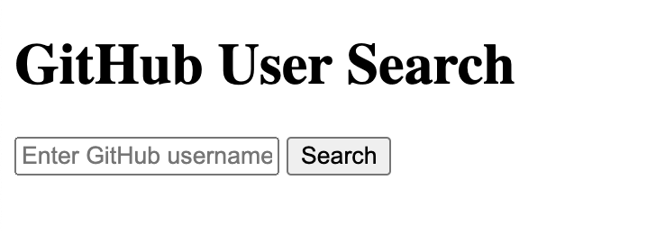

## Task Details

We have starter code in this repository to work on the given task. If you run the project, you can see the following starter demo.



## Prerequisites

### Node.js and npm:
Ensure that you have Node.js and npm (Node Package Manager) installed on your machine. You can download and install them from https://nodejs.org/.

## Procedure

### Clone the Repository:
Clone your project repository from GitHub to your local machine using the following command:

```git clone https://github.com/prakashadhikaree/js-task-nuc.git```

### Navigate to Project Directory:
Change your current working directory to the project folder:

```cd js-task-nuc```

### Install Dependencies:
Run the following command to install project dependencies:

```npm install```

### Run the Development Server:
After the installation is complete, start the development server by running:

```npm run dev```

This command will build and serve your project. It will provide you with a local development server address (usually http://127.0.0.1:5173/).

### Open in Browser:
Open your web browser and navigate to the provided local server address (e.g., http://127.0.0.1:5173/).
